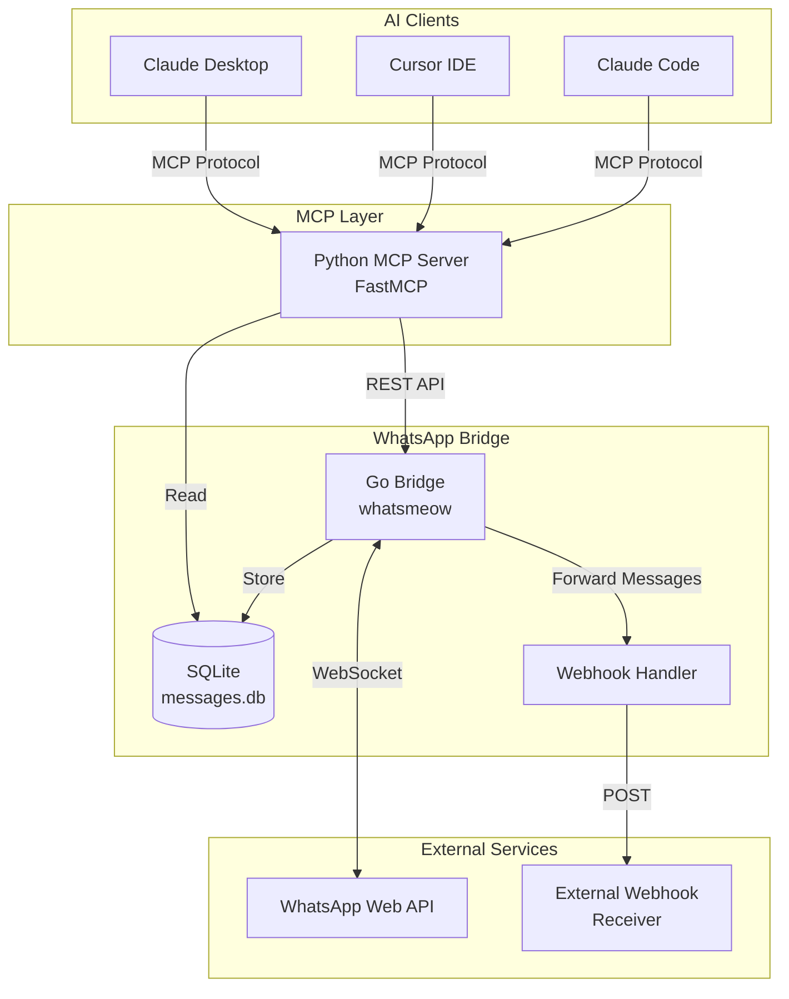
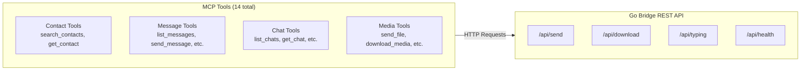
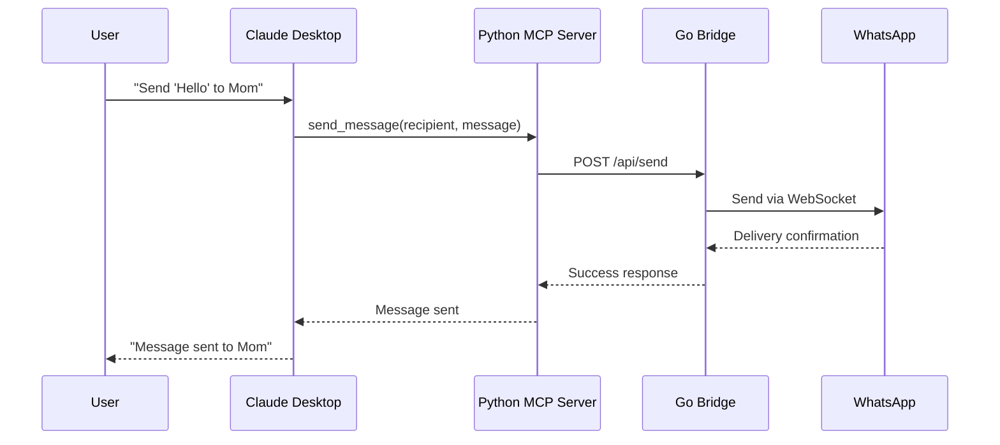
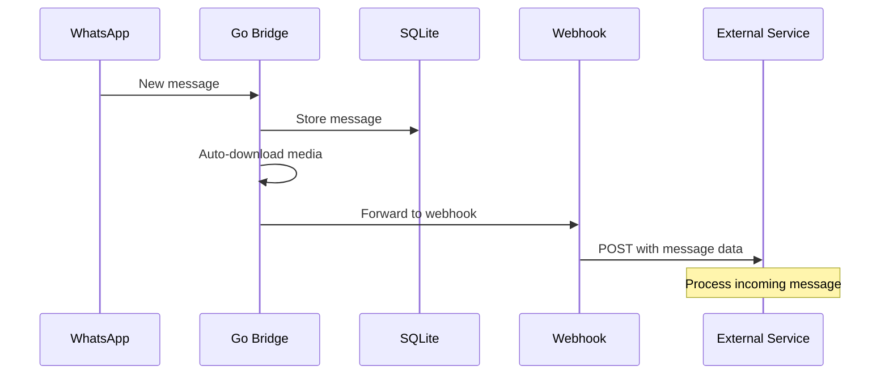

# WhatsApp MCP Server

[](https://github.com/verygoodplugins/whatsapp-mcp/actions/workflows/ci.yml)
[](https://opensource.org/licenses/MIT)
[](https://www.python.org/downloads/)
[](https://go.dev/)

A Model Context Protocol (MCP) server for WhatsApp, enabling Claude to read and send WhatsApp messages.

> Originally created by [Luke Harries](https://github.com/lharries/whatsapp-mcp). Maintained by [Very Good Plugins](https://verygoodplugins.com/?utm_source=github).

## Features

- **Message Management**: Search and read personal WhatsApp messages (text, images, videos, documents, audio)
- **Contact Search**: Search contacts by name or phone number with `sender_display` format ("Name (phone)")
- **Send Messages**: Send text messages to individuals or groups
- **Media Support**: Send and download images, videos, documents, and voice messages
- **Call History**: Capture incoming voice/video calls into a local SQLite table (live, 1:1 and group)
- **Webhook Integration**: Forward incoming messages to external services
- **Local Storage**: All messages stored locally in SQLite - only sent to Claude when you allow it

## Installation

### Prerequisites

- Go 1.24+
- Python 3.11+
- [uv](https://docs.astral.sh/uv/) package manager
- Claude Desktop or Cursor
- FFmpeg (optional, for voice message conversion)

### Quick Start

1. **Clone the repository**

   ```bash
   git clone https://github.com/verygoodplugins/whatsapp-mcp.git
   cd whatsapp-mcp
   ```

2. **Start the WhatsApp bridge**

   ```bash
   cd whatsapp-bridge
   go run .
   ```

   On first start, the bridge prints and stores a local REST API token at
   `whatsapp-bridge/store/.bridge-token`. Scan the QR code with WhatsApp on
   your phone to authenticate.

3. **Configure Claude Desktop**

   Add to `~/Library/Application Support/Claude/claude_desktop_config.json`:

   ```json
   {
     "mcpServers": {
       "whatsapp": {
         "command": "uv",
         "args": [
           "--directory",
           "/path/to/whatsapp-mcp/whatsapp-mcp-server",
           "run",
           "main.py"
         ]
       }
     }
   }
   ```

   Replace `/path/to/whatsapp-mcp` with your actual path.

4. **Restart Claude Desktop**

### Updating

Pull the latest changes, then refresh whichever components moved:

```bash
git pull
```

| You changed                                                              | What to do                                                                                                                                            |
| ------------------------------------------------------------------------ | ----------------------------------------------------------------------------------------------------------------------------------------------------- |
| **Bridge code** (`whatsapp-bridge/*.go`) and you run `go run .`          | Nothing — `go run` recompiles each launch. Just restart the bridge.                                                                                   |
| **Bridge code** and you run a built binary                               | `cd whatsapp-bridge && go build -o whatsapp-bridge && ./whatsapp-bridge`                                                                              |
| **MCP server** (`whatsapp-mcp-server/*.py`, `pyproject.toml`, `uv.lock`) | Restart Claude Desktop / Cursor — `uv` re-resolves from the lockfile on next launch. Force a sync with `cd whatsapp-mcp-server && uv sync` if needed. |

Updates do **not** require re-pairing or deleting `whatsapp.db` — your session and message history are preserved. Re-pairing is only needed when explicitly requesting full history (see [Requesting full history](#requesting-full-history)).

For `v0.2.1` and later, restart both the bridge and MCP server after updating
so the MCP server can read the bridge token. If the two components do not share
the same checkout, set the same `WHATSAPP_BRIDGE_TOKEN` value in both
environments.

### Cursor IDE Configuration

Add to your Cursor MCP settings (`~/.cursor/mcp.json`):

```json
{
  "mcp": {
    "servers": {
      "whatsapp": {
        "command": "uv",
        "args": [
          "--directory",
          "/path/to/whatsapp-mcp/whatsapp-mcp-server",
          "run",
          "main.py"
        ]
      }
    }
  }
}
```

## Tools

Messages include `sender_display` showing "Name (phone)" format for easy identification by agents.

### Contact Operations

#### `search_contacts`

Search contacts by name or phone number.

**Parameters:**

- `query` (required): Name or phone number to search

**Natural Language Examples:**

- "Find contacts named John"
- "Search for phone number 555-1234"
- "Who has the phone number starting with +1?"

#### `get_contact`

Resolve a WhatsApp contact name from a phone number, LID, or full JID.

**Parameters:**

- `identifier` (required): Phone number, LID, or full JID (aliases: `phone_number`, `phone`)
  - Examples: `12025551234`, `184125298348272`, `12025551234@s.whatsapp.net`, `184125298348272@lid`

**Natural Language Examples:**

- "What's the name for phone number 5551234567?"
- "Look up who owns this number"
- "Who is 184125298348272@lid?"

### Message Operations

#### `list_messages`

Get messages with filters, date ranges, and sorting.

**Parameters:**

- `chat_jid` (optional): Filter by specific chat JID
- `limit` (optional): Number of messages (default 50, max 500)
- `before_date` (optional): Messages before this date (YYYY-MM-DD)
- `after_date` (optional): Messages after this date (YYYY-MM-DD)
- `sort_by` (optional): "newest" or "oldest" (default "newest")

**Natural Language Examples:**

- "Show me the last 100 messages from today"
- "Get messages from the family group chat"
- "Find messages from last week"

#### `send_message`

Send a text message to a contact or group.

**Parameters:**

- `recipient` (required): Phone number or group JID
- `message` (required): Text content to send

**Natural Language Examples:**

- "Send 'Hello!' to +1234567890"
- "Message the team group saying 'Meeting at 3pm'"

#### `send_file`

Send a media file (image, video, document).

**Parameters:**

- `recipient` (required): Phone number or group JID
- `file_path` (required): Path to the file
- `caption` (optional): Caption for the media

The bridge only reads files inside configured media roots. By default this is
`~/.local/share/whatsapp-mcp/outbox`; set `WHATSAPP_MEDIA_ROOTS` to allow
additional absolute directories.

#### `send_audio_message`

Send a voice message (automatically converts to Opus .ogg format).

**Parameters:**

- `recipient` (required): Phone number or group JID
- `file_path` (required): Path to audio file

Converted audio is sent through the same media-path confinement as
`send_file`.

#### `download_media`

Download media from a received message.

**Parameters:**

- `message_id` (required): ID of the message with media
- `chat_jid` (required): JID of the chat containing the message

### Chat Operations

#### `list_chats`

List all chats with metadata.

**Parameters:**

- `limit` (optional): Number of chats (default 50, max 200)

#### `get_chat`

Get specific chat metadata by JID.

**Parameters:**

- `jid` (required): Chat JID

#### `get_direct_chat_by_contact`

Find a direct message chat with a contact.

**Parameters:**

- `phone` (required): Phone number of the contact

#### `get_contact_chats`

List all chats involving a specific contact.

**Parameters:**

- `phone` (required): Phone number of the contact

#### `get_last_interaction`

Get the last message exchanged with a contact.

**Parameters:**

- `phone` (required): Phone number of the contact

#### `get_message_context`

Get messages around a specific message for context.

**Parameters:**

- `message_id` (required): ID of the target message
- `chat_jid` (required): JID of the chat
- `before` (optional): Number of messages before (default 5)
- `after` (optional): Number of messages after (default 5)

## Configuration

Copy `.env.example` to `.env` and configure as needed:

| Variable               | Default                                  | Description                                  |
| ---------------------- | ---------------------------------------- | -------------------------------------------- |
| `WHATSAPP_BRIDGE_PORT` | `8080`                                   | Port for Go bridge REST API                  |
| `WEBHOOK_URL`          | `http://localhost:8769/whatsapp/webhook` | Webhook for incoming messages                |
| `FORWARD_SELF`         | `false`                                  | Forward messages sent by self                |
| `WHATSAPP_DB_PATH`     | `../whatsapp-bridge/store/messages.db`   | Path to SQLite database                      |
| `WHATSMEOW_DB_PATH`    | `../whatsapp-bridge/store/whatsapp.db`   | whatsmeow DB used for LID ↔ phone resolution |
| `WHATSAPP_API_URL`     | `http://localhost:8080/api`              | Go bridge REST API URL                       |
| `WHATSAPP_BRIDGE_TOKEN` | generated in `whatsapp-bridge/store/.bridge-token` | Bearer token required for bridge REST calls |
| `WHATSAPP_MEDIA_ROOTS` | `~/.local/share/whatsapp-mcp/outbox`     | Path-list of directories allowed for outbound media files |
| `WHATSAPP_MCP_TRANSPORT` | `stdio`                                | MCP transport to serve clients: `stdio`, `http`, or `sse` |
| `WHATSAPP_MCP_HOST`    | `127.0.0.1`                              | Bind address for the `http`/`sse` transports |
| `WHATSAPP_MCP_PORT`    | `8000`                                   | Port for the `http`/`sse` transports |

### MCP transport (stdio vs http/sse)

By default the server speaks MCP over **stdio**, which is what local clients
like Claude Desktop and Cursor launch. To serve the server over the network
instead, set `WHATSAPP_MCP_TRANSPORT`:

```bash
# Streamable HTTP (current spec transport for remote MCP), endpoint at /mcp
WHATSAPP_MCP_TRANSPORT=http WHATSAPP_MCP_PORT=8000 uv run main.py

# Legacy Server-Sent Events transport (deprecated in the MCP spec), endpoint at /sse
WHATSAPP_MCP_TRANSPORT=sse uv run main.py
```

`http` is an alias for the spec's `streamable-http` transport and is the
recommended choice for remote connections; `sse` is kept for older clients.

> **Security:** `WHATSAPP_MCP_HOST` defaults to `127.0.0.1`, so the HTTP/SSE
> server is reachable only from the local machine. The server has no built-in
> authentication, and the underlying bridge can read and send WhatsApp messages
> on your account. Only bind to a non-loopback address (e.g. `0.0.0.0`) if you
> place an authenticating reverse proxy or tunnel in front of it.

### Bridge authentication and media paths

The bridge requires bearer-token authentication for every `/api/*` request and
accepts only exact loopback Host headers for its configured port. This protects
the local REST API from other local processes and browser DNS-rebinding attacks.

On first start, the bridge generates a 256-bit token, writes it to
`whatsapp-bridge/store/.bridge-token` with owner-only permissions, and prints a
setup banner. The MCP server reads `WHATSAPP_BRIDGE_TOKEN` first, then falls
back to that token file. For split deployments, containers, or process managers
that do not share the repository directory, set the same
`WHATSAPP_BRIDGE_TOKEN` value for both the bridge and MCP server.

Outbound `media_path` values are confined to `WHATSAPP_MEDIA_ROOTS`. The default
outbox is `~/.local/share/whatsapp-mcp/outbox`, created on bridge startup. Move
files there before calling `send_file` or `send_audio_message`, or set
`WHATSAPP_MEDIA_ROOTS` to a colon-separated list of absolute directories.

### CLI flags (Go bridge)

| Flag                  | Default | Description                                                                                                                                                                                                                                                       |
| --------------------- | ------- | ----------------------------------------------------------------------------------------------------------------------------------------------------------------------------------------------------------------------------------------------------------------- |
| `--full-history-pair` | `false` | Request full history at pair time. Only takes effect on a fresh pair (no existing `whatsapp.db`); no-op for already-paired sessions. The phone ultimately decides the actual history window sent — see [Requesting full history](#requesting-full-history) below. |

### Requesting full history

whatsmeow's default pairing asks for "recent sync" — roughly the last 3 months, with the exact window decided by the phone. If you want to pull more history at pair time:

```bash
# Stop the bridge
launchctl bootout gui/$UID/com.whatsapp-bridge    # or however you manage it

# Back up, then remove the auth session (keeps messages.db intact)
cp whatsapp-bridge/store/whatsapp.db{,.bak}
rm whatsapp-bridge/store/whatsapp.db

# Re-pair with the flag
cd whatsapp-bridge
./whatsapp-bridge --full-history-pair
# Scan the QR with WhatsApp → Settings → Linked Devices → Link a Device
# Wait for "History sync complete" in the logs (can take 10-30 minutes)
# Ctrl+C when sync has quiesced, then restart under your normal process manager
```

Caveats:

- **The phone decides the actual cap.** The flag requests up to 10 years / 100 GB, but WhatsApp's iOS primary device enforces its own retention policy. iPad companion is documented at ~1 year max; other linked devices appear to follow similar logic.
- **Only effective on a fresh pair.** With `whatsapp.db` already present, no new pair handshake fires and the flag is a no-op.
- **Messages the phone has deleted are not recoverable** — auto-expire, low-storage cleanup, and manual delete all leave no trace for the phone to share.

## Call History

The bridge captures incoming WhatsApp voice and video calls live into a
dedicated `calls` table in `messages.db`. When a 1:1 call arrives
(`CallOffer`) or a group call is announced (`CallOfferNotice`), a row is
inserted with `result='in_progress'`. Subsequent `CallAccept` /
`CallReject` / `CallTerminate` events update the row — final result becomes
`answered`, `rejected`, `missed`, or `ended` depending on the event
sequence. See the state-machine comment above `StoreCallOffer` in `main.go`
for the exact transitions.

### Schema

```sql
CREATE TABLE calls (
    call_id TEXT,
    chat_jid TEXT,          -- group JID for group calls, call creator JID for 1:1
    from_jid TEXT,          -- JID of whoever started the call
    timestamp TIMESTAMP,    -- call start time
    is_from_me BOOLEAN,
    call_type TEXT,         -- 'voice' or 'video'
    is_group BOOLEAN,
    result TEXT,            -- 'in_progress' | 'answered' | 'ended' |
                            --   'missed' | 'rejected'
    duration_sec INTEGER,   -- computed when the call terminates
    ended_at TIMESTAMP,
    reason TEXT,            -- terminate reason string from whatsmeow
    PRIMARY KEY (call_id, chat_jid)
);
```

### Caveats

- **Outbound calls are not captured.** WhatsApp's primary device handles
  calls it initiates without notifying linked devices, so the bridge never
  sees an event for them.
- **Call results only reflect what the bridge saw.** If the bridge is
  offline when a call happens, the events are lost.
- **1:1 calls default to `call_type='voice'`.** `CallOffer` events don't
  expose media type directly (it's buried in the binary call data). Group
  calls via `CallOfferNotice` include a `Media` field and are recorded
  accurately as voice or video.

## Architecture



### Component Details



### Data Flow



### Incoming Message Flow



## Development

### Running Tests

```bash
cd whatsapp-mcp-server
uv pip install -e ".[dev]"
uv run pytest -v
```

### Linting

```bash
# Python
cd whatsapp-mcp-server
uv run ruff check .
uv run ruff format .

# Go
cd whatsapp-bridge
golangci-lint run
```

### Building

```bash
# Go bridge
cd whatsapp-bridge
go build -o whatsapp-bridge

# Run the binary
./whatsapp-bridge

# During development (avoids stale binaries)
go run .
```

### Releasing (Maintainers)

Releases use Release Please automation; maintainer steps and fallback procedures
are documented in [docs/RELEASING.md](docs/RELEASING.md).

## Troubleshooting

### Authentication Issues

- **QR Code Not Displaying**: Restart the bridge. Check terminal QR code support.
- **Device Limit Reached**: Remove a linked device from WhatsApp Settings > Linked Devices.
- **No Messages Loading**: Initial sync can take several minutes for large chat histories.
- **Out of Sync**: Delete `whatsapp-bridge/store/*.db` files and re-authenticate.
- **Bridge returns 401 Unauthorized**: Restart the bridge so it creates
  `whatsapp-bridge/store/.bridge-token`, then restart the MCP server. If the MCP
  server cannot read that file, set `WHATSAPP_BRIDGE_TOKEN` to the same value in
  both environments.
- **Bridge returns 403 Forbidden for Host**: Use `WHATSAPP_API_URL` with
  `http://127.0.0.1:<port>/api`, `http://localhost:<port>/api`, or
  `http://[::1]:<port>/api`; custom hostnames and missing ports are rejected.
- **Bridge returns 403 Forbidden for media_path**: Move the file into
  `~/.local/share/whatsapp-mcp/outbox` or add its absolute parent directory to
  `WHATSAPP_MEDIA_ROOTS`.

### Windows

Windows requires CGO for go-sqlite3. Install [MSYS2](https://www.msys2.org/) and enable CGO:

```bash
go env -w CGO_ENABLED=1
go run .
```

## Security Notice

> **Caution**: As with many MCP servers, this is subject to [the lethal trifecta](https://simonwillison.net/2025/Jun/16/the-lethal-trifecta/). Prompt injection could lead to private data exfiltration. Use with awareness.

## License

MIT License - see [LICENSE](LICENSE) for details.

## Credits & History

This project is a maintained fork of [lharries/whatsapp-mcp](https://github.com/lharries/whatsapp-mcp), originally created by [Luke Harries](https://github.com/lharries).

**Why we forked:** The original repository hasn't been updated since April 2025. We needed continued maintenance, bug fixes, and new features for production use.

**Highlights since the fork:**

- `/api/typing`, `/api/health`, and webhook forwarding (with reply context + image media)
- Auto-download of incoming media with collision-safe filenames
- `get_contact` tool, `sender_display` field, and LID ↔ phone resolution via the whatsmeow store
- Live capture of incoming voice/video calls into a `calls` table
- `--full-history-pair` flag to request extended history at pair time
- Resilience: recovers from `StreamReplaced` session conflicts; pinned `anyio` to dodge a cancel-scope regression
- CI/CD with GitHub Actions, Release Please for automated versioning, and Dependabot

The full release-by-release list lives in [CHANGELOG.md](CHANGELOG.md).

**Recent contributors** (huge thanks):

- [@edmenendez](https://github.com/edmenendez) — call capture (#39), full-history flag (#37), caption surfacing (#42), media filename collisions (#40), download race fix (#41), LID matching (#43), contact resolution via whatsmeow store (#30)
- [@davidsimoes](https://github.com/davidsimoes) — `StreamReplaced` recovery (#27)
- [@davidggphy](https://github.com/davidggphy) — LID → phone JID consistency (#12)
- [@maikol-solis](https://github.com/maikol-solis) — bridge run command fix (#23)
- [@DeetBot](https://github.com/DeetBot) — `anyio` cancel-scope pin (#44)

And to Luke for creating the original project. See [CONTRIBUTING.md](CONTRIBUTING.md) if you'd like to join in.

## Links

- [Very Good Plugins](https://verygoodplugins.com/?utm_source=github)
- [MCP Specification](https://modelcontextprotocol.io/)
- [whatsmeow](https://github.com/tulir/whatsmeow) - WhatsApp Web API library for Go
- [FastMCP](https://github.com/jlowin/fastmcp) - Fast Model Context Protocol implementation
